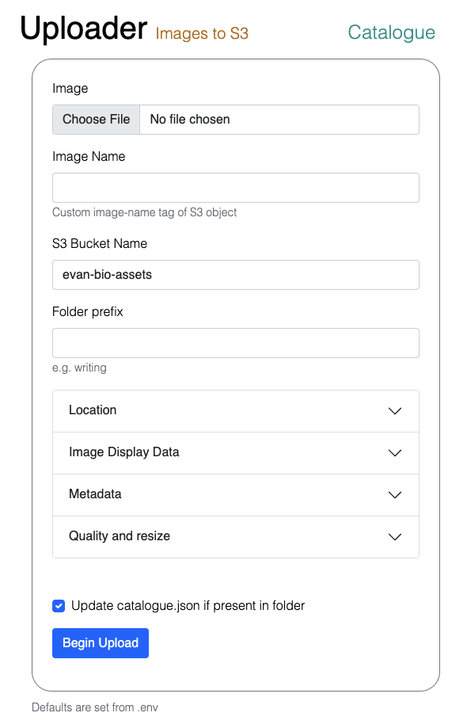

# Uploader
 
A CMS tool to set image metadata, resize, and upload to S3. Intended to be run locally in a browser.

## Usage

1. Have Node.js version `16+`
1. Copy values in `.env.example` to a new `.env` file.
1. Run `npm i` in this directory
1. Run `npm start` to begin uploading images.
1. If you want to use the location geocoder, `GOOGLE_MAPS_API_KEY` has to have the `geocoder` API enabled in Google Cloud.

## Features

- Image Resize and uploads to S3
- Geocoded image location extracted from image and saved as metadata with lat/long cords using Google API
- Maintains a `catalogue.json` in selected S3 bucket to be consumed by photography site

## Screenshots

